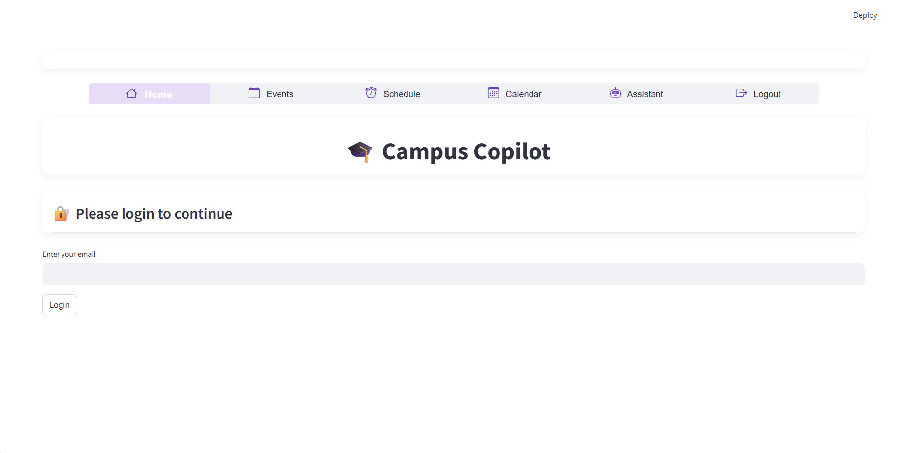
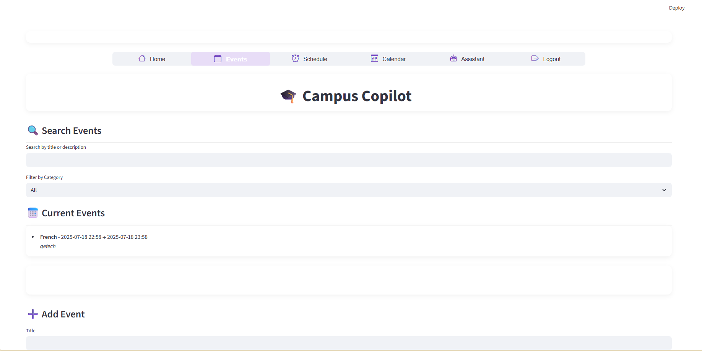
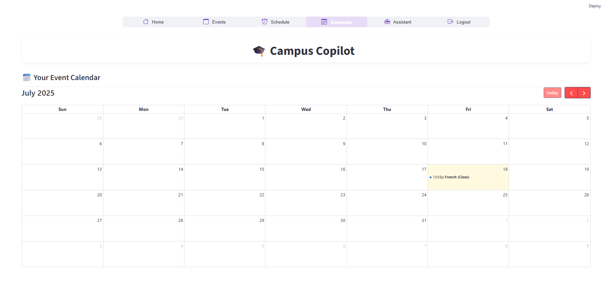
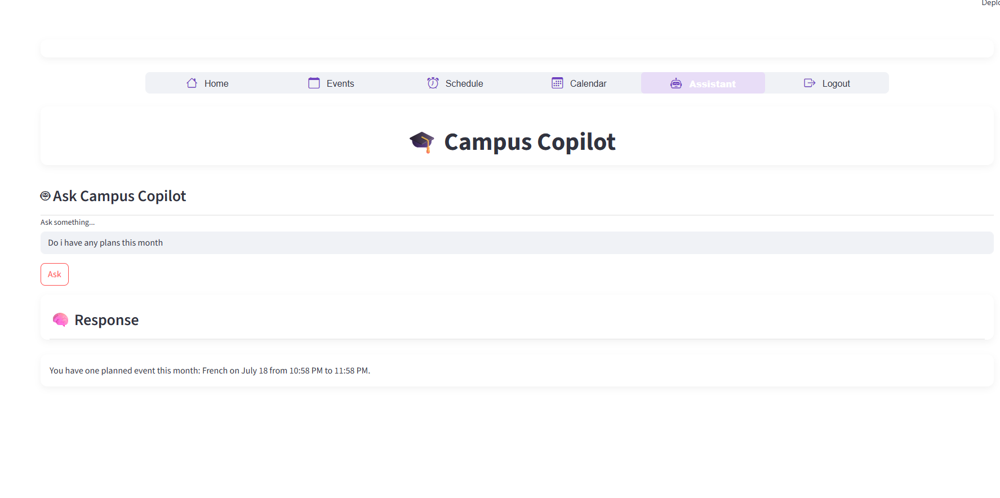

# 🎓 Campus Copilot – Your Personal College Assistant

> A smart assistant to manage your college life. Plan events, track deadlines, visualize your calendar, and get agenda updates – all in one place!

---
## 🔗 Demo Link

- 🎥 [Watch the Demo Video](https://youtu.be/your-demo-video-id)
- 🌐 [Try the Live App](https://campus-copilot.streamlit.app)

## 🚀 Features

* ✅ Login with email
* ➕ Add events with title, description, time, and category
* 🔍 Filter and search events by keyword or category
* 📅 Visual calendar view
* ✉️ Send event agenda to email (via SendGrid)
* 🧠 Ask Copilot Assistant (powered by LLM via Groq + LangChain)
* ❌ Delete events
* 💡 Beautiful Lottie animation

---

## ⚖️ Problem Statement

**Hackathon Theme**: Campus Copilot – Your Personal College Assistant

> Students often miss deadlines, college updates, and event notifications. Build a smart assistant that keeps track of classes, club events, notices, and deadlines – all in one place with calendar sync and reminders.

---

## 🛠️ Tech Stack

| Layer         | Tech Used                         |
| ------------- | --------------------------------- |
| UI            | Streamlit, Lottie Animation       |
| Backend       | Python, LangChain, Groq API       |
| DB Storage    | AstraDB (Vector + Document Store) |
| Email Service | SendGrid                          |

---

## 📁 Folder Structure

```bash
campus_copilot/
|--requirements.txt # requirements
|--lottieflow-attention-09-000000-easey.json # theme animation file
├── main.py               # Streamlit frontend logic
├── events.py             # Event class and manager
├── db.py                 # AstraDB CRUD operations
├── assistant.py          # LLM-powered assistant
├── scheduler.py          # Schedule and agenda logic
├── utils.py              # SendGrid email function
├── .env                  # Your API credentials
└── README.md             # This file
```

---

## 🔑 Environment Variables (.env)

```env
SENDGRID_API_KEY=your_sendgrid_key
FROM_EMAIL=your_verified_sender_email
GROQ_API_KEY=your_groq_key
ASTRA_DB_API_ENDPOINT=your_astra_endpoint
ASTRA_DB_APPLICATION_TOKEN=your_astra_token
ASTRA_DB_COLLECTION=events
ASTRA_DB_KEYSPACE=campus_copilot
ASTRA_DB_REGION=us-east1
```

---

## 📅 Event Categories Supported

* Class
* Club
* Exam
* Assignment
* Other

---

## 🔧 Setup Instructions

```bash
# 1. Clone repo and install dependencies
pip install -r requirements.txt

# 2. Set up your .env file with correct keys

# 3. Run the app
streamlit run main.py
```

---

## 📹 Demo Walkthrough

1. Login with your email (used to store user-specific events)
2. Add events with category + description
3. Search / filter events
4. View calendar tab to see events visually
5. Ask assistant: "What are my events tomorrow?"
6. Send email agenda (note: may default to dev email)
7. Delete event

---

## ⚠️ Limitations

* ✉ Email may send **but will have a delay of 10-15 min** due to SendGrid free tier or fallback logic. You can fix this by editing `utils.py > send_email()`.
* No Google Calendar sync (could be added in future!)
* No SMS due to Twilio cost (optional upgrade)

---

## 💼 Hackathon-Ready?

**Yes!** This is a complete working system that showcases:

* Full-stack AI Assistant
* DB integration
* Email automation
* Visual UI polish

## 📷 Screenshots
### home page with authentication.

### event pages

### scheduling with email notifcation

### calender view with all plans showing 

### An Assitant - A ChatBot for complete info about the schedule and events.

---

## 📄 License

MIT

---

## ✨ Made with passion by Abhinav Sunil #BuildWithAI
